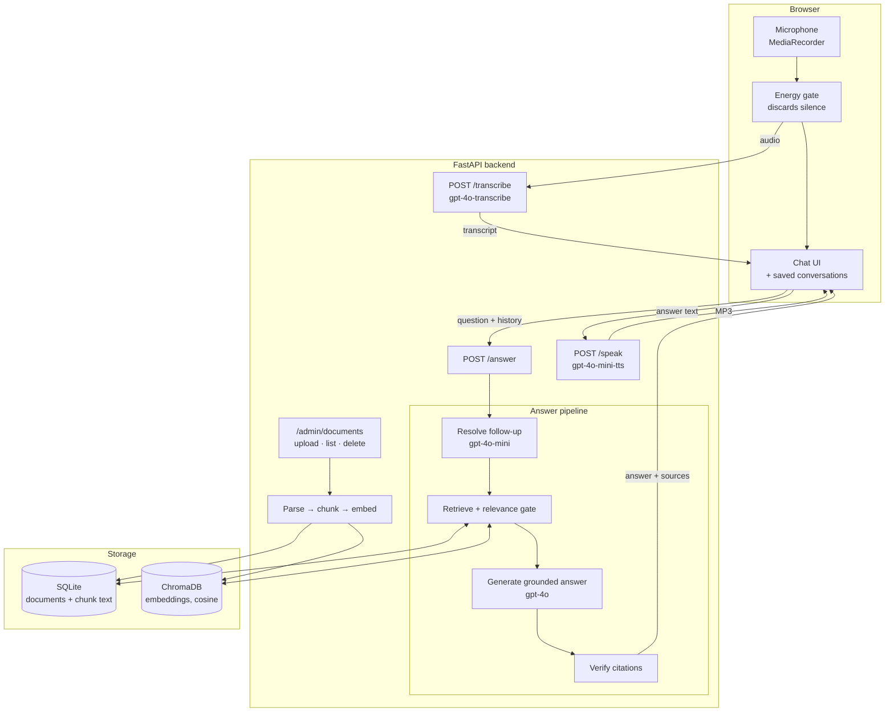

# RAG Voice Assistant

An Albanian-language voice assistant that answers questions about a company's
internal policies, grounded in retrieval over a Knowledge Base, and refuses
explicitly when the documents do not support an answer.

You ask by voice. The system transcribes the question, searches the Knowledge
Base, answers **only** from what it retrieved, cites the passages it used, and
reads the answer aloud. Follow-up questions keep their context. A question the
documents do not cover gets a refusal, not a guess.

The entire product — interface, error messages, model output, speech and the
corpus itself — is in Albanian. The repository is in English.

---

## Why the interesting part is the refusal

Any RAG demo can answer a question it was built to answer. This one is
organised around the harder case: what happens when it should not answer.

Three independent layers stand between a question and an answer, and none is
sufficient alone.

**1. Relevance gate.** If nothing in the corpus is close enough to the
question, retrieval returns nothing and the question is refused without ever
reaching the language model. The threshold is a measured value, not a guess —
see [Measured results](#measured-results).

**2. Grounded generation.** The model is given the retrieved passages and
instructed to answer from them alone, to say when it cannot, and to *correct* a
false premise rather than accept it. Asked "Of the 30 days of annual leave, how
many can I carry over?", it answers that annual leave is 21 days, not 30.

**3. Citation verification.** The model cites passages by number. Citations
outside the supplied set are dropped, and an answer left with no verifiable
citation is discarded and becomes a refusal. This is what makes a citation a
fact about the answer rather than a claim by the model.

The layering is deliberate and it is visible in the numbers: three of the
out-of-scope questions score high enough to clear the relevance gate and are
stopped by grounding instead. A similarity score cannot tell "nearby subject"
from "answers the question", and tightening the gate until it could would start
refusing valid questions.

---

## Architecture



**The API is stateless.** Conversation history is sent by the client on every
`/answer` call — there is no session store and nothing to expire. Follow-ups
work by *rewriting* the question into a standalone one before retrieval, so no
fact survives a turn without being fetched again for the current question.

---

## Tech stack

| Layer | Choice |
| --- | --- |
| Frontend | React 19, Vite, TypeScript, Tailwind v4, shadcn/ui, Animate UI |
| Backend | Python 3.13, FastAPI |
| Speech-to-text | OpenAI `gpt-4o-transcribe` (`whisper-1` fallback) |
| Answer generation | OpenAI `gpt-4o` |
| Follow-up resolution | OpenAI `gpt-4o-mini` |
| Embeddings | OpenAI `text-embedding-3-small` |
| Text-to-speech | OpenAI `gpt-4o-mini-tts` |
| Vector store | ChromaDB, embedded, cosine distance |
| Metadata store | SQLite |

**One provider: OpenAI.** The project originally planned a second provider for
text-to-speech on the basis that it supported Albanian. It does not — see
[Known limitations](#known-limitations).

---

## Quick start

**Prerequisites:** Python 3.13, Node 20.19+ or 22.12+, and an OpenAI API key.

```bash
git clone https://github.com/arberzylyftari/rag-voice-assistant-project.git
cd rag-voice-assistant-project
```

### Backend

```bash
cd backend
python3.13 -m venv .venv
source .venv/bin/activate
pip install -r requirements.txt

cp .env.example .env          # add OPENAI_API_KEY, and ADMIN_TOKEN for /admin
python scripts/reindex.py     # build the Knowledge Base index
uvicorn app.main:app --reload --port 8000
```

### Frontend

In a second terminal:

```bash
cd frontend
npm install
cp .env.example .env
npm run dev
```

Open **http://localhost:5180** and press the microphone. The admin panel is at
`/admin`.

> The dev server port is pinned to 5180 with `strictPort`. Vite otherwise falls
> back to the next free port without failing, which silently breaks CORS in a
> way that looks like a backend bug. If you change it, change `CORS_ORIGINS` on
> the backend to match.

Microphone access needs a secure context — `localhost` qualifies, a plain-HTTP
LAN address does not.

### Tests

```bash
cd backend && pytest         # 110 tests, providers stubbed, no API calls
npm run build --prefix frontend
npm run lint --prefix frontend
```

---

## Try it

The corpus is seven fictional internal policies of **Nexora sh.p.k.**, an
invented software company. Nothing in it describes a real company and it
contains no real personal data.

| Ask | What should happen |
| --- | --- |
| *Sa ditë pushimi vjetor kam?* | Answers with sources |
| *Po pas pesë vjetësh?* | Resolves against the previous turn, then retrieves again |
| *Çfarë duhet të dorëzoj ditën e fundit të punës?* | Answers from two documents |
| *Nga 30 ditët e pushimit vjetor, sa mund të bart?* | Corrects the premise — leave is 21 days |
| *A lejohen kafshët shtëpiake në zyrë?* | Refuses; the documents do not cover it |

The full question sets are in
[docs/sample-documents/README.md](docs/sample-documents/README.md).

---

## Measured results

Everything below was measured, not estimated. The evaluation sets are small —
see the caveat under [Known limitations](#known-limitations).

| | Result |
| --- | --- |
| In-scope questions answered correctly | 8/8 |
| False premises corrected | 3/3 |
| Out-of-scope questions refused | 6/6 |
| Albanian STT accuracy, with the Albanian prompt | 0.96 |
| Albanian STT accuracy, without it | 0.64 |
| TTS round-trip fidelity | 0.96–0.99 |
| Corpus | 7 documents, 85 chunks |

**Relevance threshold.** Measured over 24 in-scope and 12 out-of-scope
questions:

| Threshold | Accepts in-scope | Refuses out-of-scope |
| --- | --- | --- |
| 0.74 | 24/24 | 7/12 |
| **0.75** | **24/24** | **9/12** |
| 0.76 | 23/24 | 9/12 |
| 0.79 | 21/24 | 12/12 |

0.75 filters as much as possible without refusing a single valid question. At
0.79 all out-of-scope questions are caught, but three valid ones are lost —
including *"Si e rivendos fjalëkalimin?"*, which the documents answer directly.
Losing real questions to catch borderline ones is the wrong trade when a second
layer already catches them.

**Model choice.** `gpt-4o-mini` and `gpt-4o` both answer in-scope questions
correctly (8/8) and refuse out-of-scope ones (6/6). They differ on false
premises: mini corrects 2 of 3 and refuses the third, `gpt-4o` corrects 3 of 3.
A refusal is safe but is a weaker answer, so generation uses `gpt-4o`.

---

## Known limitations

Stated plainly, because a demo that hides these is less useful than one that
does not.

**No provider officially supports Albanian text-to-speech.** ElevenLabs does
not list it among the 74 languages of `eleven_v3`; Azure marks `sq-AL`
explicitly unsupported for TTS while supporting it for speech-to-text; Google
does not carry it; OpenAI does not list it either. OpenAI nevertheless produces
intelligible Albanian, which is why it is used. **The 0.96–0.99 figure measures
intelligibility to a machine, not naturalness to a native speaker** — it is a
round trip through synthesis and back through transcription. Pronunciation and
prosody are audibly non-native. This was a correction to an earlier decision
that rested on an unverified claim of Albanian support.

**Speech-to-text does not accept Albanian as a language parameter.** Both
`gpt-4o-transcribe` and `whisper-1` reject `language="sq"` with a 400. Albanian
is steered by an Albanian-language prompt instead, which is the difference
between 0.64 and 0.96 accuracy — without it, short clips get misdetected as
entirely different languages.

**The STT accuracy figure comes from synthetic speech.** The fixtures were
generated with OpenAI TTS, which does not officially support Albanian, so some
of the residual error is the synthetic pronunciation rather than the
transcriber. **Real human Albanian speech has not been evaluated
systematically.** Accents and dialect should be expected to perform worse than
0.96.

**Transcription invents speech from silence.** Given wordless audio it does not
return an empty string — it produces a fluent, plausible question, sometimes a
brand-new one that would pass retrieval and receive a cited answer as if it had
been asked. Two defences exist: a browser-side energy gate that refuses to
upload silence, and a backend filter for transcripts echoing the prompt. The
energy gate is the primary one, so **a direct API call bypasses it.**

**The relevance threshold is calibrated to this corpus.** 0.75 was measured
against 85 chunks. It is not a universal constant and should be re-measured if
the corpus grows substantially.

**The evaluation sets are small.** 8 in-scope, 3 false-premise and 6
out-of-scope questions for the end-to-end results; 24 and 12 for the threshold.
These are indicative and were enough to make specific decisions, but they are
not a statistically robust benchmark.

**Conversation history is per-browser.** It lives in `localStorage`, so it does
not follow you to another device and clearing browser data deletes it. This is
deliberate: a shared table behind an API with no user accounts would show every
visitor to a public demo the conversations of every other visitor. Recordings
are not stored either — a reopened conversation shows the transcript without a
player, though the answer can still be spoken, because it is re-synthesised on
demand.

**There is no user authentication.** The chat is open to anyone who can reach
it. The admin endpoints are protected by a single shared token, not accounts or
roles — and an unset `ADMIN_TOKEN` disables them entirely rather than leaving
them open.

**Storage is file-based and single-process.** SQLite and an embedded ChromaDB
need a persistent disk; the backend will not run correctly on a serverless
platform with ephemeral storage. It is sized for a demo, not for concurrent
load.

**The frontend has no committed tests.** The backend has 110. Frontend
behaviour has been verified with Playwright scripts written per change, but
those have not been added to the repository — this is recorded technical debt,
not an oversight.

**It is not deployed.** Everything above runs locally.

---

## Future improvements

- Evaluate against real human Albanian speech, including accents and dialect,
  rather than synthetic fixtures.
- Move to a native Albanian voice if a provider offers one — `TTS_MODEL` and
  `TTS_VOICE` are configuration, so this is not a code change.
- Commit the frontend test suite and run both suites in CI.
- Deploy, on a platform with a persistent disk.
- Expand the evaluation sets enough to make the numbers robust rather than
  indicative.
- Stream answers token by token instead of waiting for the full response.

---

## Repository layout

```
├── backend/            FastAPI service — see backend/README.md
│   ├── app/
│   │   ├── routers/    transcribe · search · answer · speak · admin
│   │   ├── services/   chunking · retrieval · generation · speech · …
│   │   ├── config.py   all settings, environment-overridable
│   │   └── db.py       SQLite schema + migrations
│   ├── scripts/        reindex.py
│   └── tests/          110 tests, providers stubbed
├── frontend/           React SPA — see frontend/README.md
│   └── src/
│       ├── pages/      ChatPage · AdminPage
│       ├── components/ shadcn/ui + Animate UI only
│       ├── hooks/      recorder · conversation · speech · theme
│       └── lib/        api · conversations · loudness · theme
└── docs/
    └── sample-documents/   the Knowledge Base corpus (Albanian)
```

## Documentation

| Document | Contents |
| --- | --- |
| [backend/README.md](backend/README.md) | Every endpoint with request and response examples, the guardrail layers, indexing, environment variables |
| [frontend/README.md](frontend/README.md) | Conversation loop, saved conversations, theme, admin panel, silence detection |
| [docs/sample-documents/README.md](docs/sample-documents/README.md) | The corpus, how it is written, and the full test question sets |
